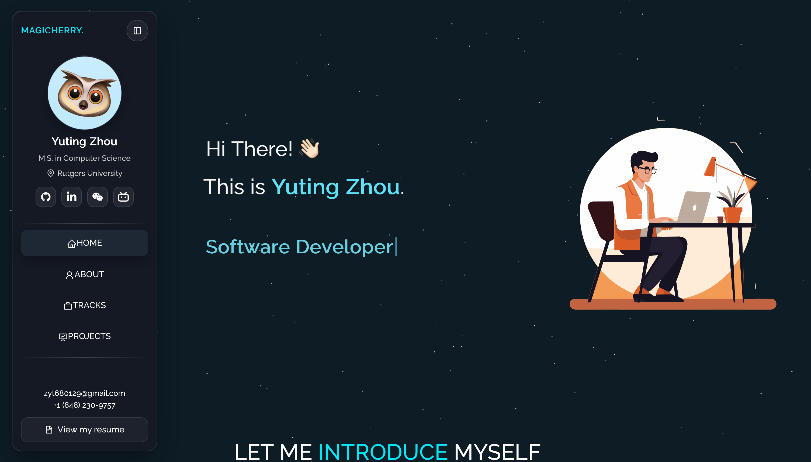

<h2 align="center">
  Bits of Me - Personal Portfolio <br/>
  <a href="https://magicherry.github.io/" target="_blank">magicherry.github.io</a>
</h2>

<p align="center">
  
  
  
  
  
</p>

## Overview

A fully customized React-based portfolio evolved from an open-source template.
Built with maintainability, mobile-first responsiveness, and polished UI interactions in mind.



---

## Highlights
- Polished personal portfolio built with a modern React 18 stack
- Adaptive navigation experience across desktop and mobile, including top, side, and bottom layouts
- Redesigned Projects section with flexible list and grid presentations
- Dedicated Tracks page highlighting professional experience and growth
- Mobile-first responsive design with smooth, intuitive interactions
- Subtle animations and glassmorphic visuals for a clean, contemporary aesthetic

## Prerequisites & Setup

Clone down this repository. You will need these tools installed:
- `git` (for cloning)
- `node` 20.x (LTS) and `npm` (bundled with Node)
- Optional: `nvm` for managing Node versions
- Optional: `vercel` CLI if you plan to deploy with Vercel

## Local Development

Install dependencies and start the development server:
```bash
npm install
npm start
```

Runs the app in the development mode.\
Open [http://localhost:3000](http://localhost:3000) to view it in the browser.

The page will reload if you make edits.

## Usage

Open the project folder and Navigate to `/src/components/`. <br/>
Each section is modularized for clarity, making it easy to adjust structure, visuals, or interactions as the portfolio evolves.

## Acknowledgements

Grateful to the open-source community and the following projects for inspiration and building blocks:
- [React](https://react.dev)
- [Bootstrap](https://getbootstrap.com/)
- [React-Bootstrap](https://react-bootstrap.github.io/)
- [React Icons](https://react-icons.github.io/react-icons)
- [Vercel](https://vercel.com/)
- Contributors of the original portfolio template by [Soumyajit](https://github.com/soumyajit4419/Portfolio)
