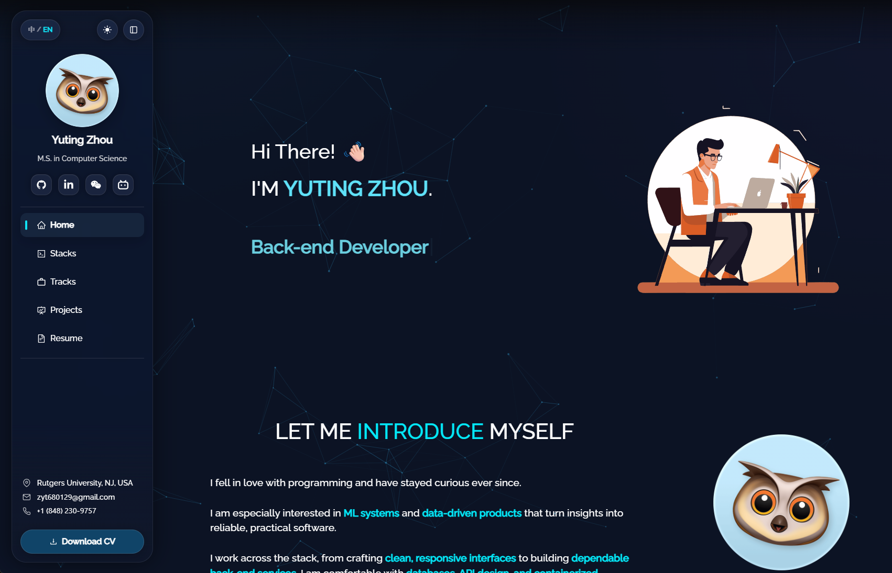
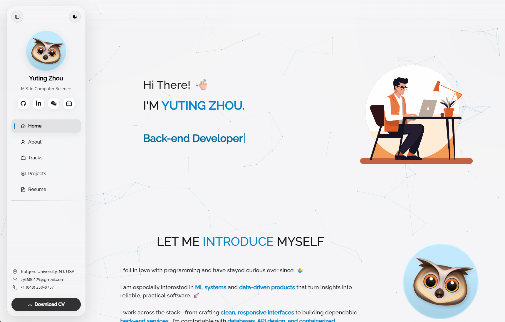

<h2 align="center">
  Bits of Me - Personal Portfolio <br/>
  <a href="https://magicherry.github.io/" target="_blank">magicherry.github.io</a>
</h2>

<p align="center">
  
  
  
  
  
</p>

## Overview

A modern, highly interactive personal portfolio built with React. Evolved from an open-source template, this project has been extensively customized with a focus on **fluid animations**, **glassmorphic design**, and a **wonderful user experience**. 

Whether viewed on a desktop or a mobile device, the portfolio adapts seamlessly—featuring dynamic navigation systems, interactive project showcases, and subtle visual feedback that brings the interface to life.

### Previews

| Dark Mode | Light Mode |
| :---: | :---: |
|  |  |


---

## Highlights & Features

### Appearance

- **Dynamic Theming**: Seamless Light and Dark modes that automatically sync with system preferences, featuring smooth transitions and tailored glassmorphic effects for both themes.
- **Bilingual Experience**: Built-in Chinese and English switching with automatic browser-language detection and temporary manual override support.
- **Responsive & Polished**: Mobile-first design with glassmorphic visuals, subtle blurs, and a clean contemporary aesthetic.

### Navigation & Interaction

- **Advanced Navigation System**: Floating glassmorphic top pill navigation on desktop, with an optional side panel and an app-like bottom navigation bar on mobile.
- **Interactive UI/UX**: Custom mouse glow effects, scroll-triggered fade-in animations, and an interactive particle background powered by `@tsparticles/react`.

### Content

- **Modern Tech Stack**: Built with React 19, React Router v6, and Bootstrap 5.
- **Project Showcase**: Redesigned Projects section with tag filtering and flexible List/Grid layout toggles.
- **Professional Tracks**: Dedicated experience timeline using `react-vertical-timeline-component`.
- **Integrated Resume**: Built-in PDF viewer using `react-pdf`, with separate Chinese and English resume files.
- **GitHub Integration**: Live GitHub contribution calendar visualization.

## Prerequisites

Clone down this repository. You will need these tools installed:

- `git` (for cloning)
- `node` 20.16+ or 22.3+ and `npm` (bundled with Node)
- Optional: `nvm` for managing Node versions
- Optional: `vercel` CLI if you plan to deploy with Vercel

> Recommended: use Node `20.16+` to avoid engine warnings from `react-pdf` / `pdfjs-dist`.

## Local Development

Install dependencies and start the development server:

```bash
npm install
npm start
```

Runs the app in the development mode.  
Open [http://localhost:3001](http://localhost:3001) to view it in the browser.

The page will reload if you make edits.

## Usage & Customization

Open the project folder and navigate to `/src/components/`.   

Each section is modularized for clarity, making it easy to adjust structure, visuals, copy, or interactions as the portfolio evolves.

- **Data Customization**: Update your personal information, projects, and experiences in the respective data files (e.g., `src/components/Projects/ProjectData.js` and `src/components/Experiences/ExperienceData.js`).
- **Localization**: Adjust language behavior in `src/context/LanguageContext.js` and update bilingual copy directly in the related components.
- **Assets**: Replace images in the `src/Assets/` directory.
- **Resume**: Replace `src/Assets/cv/Yuting_Zhou_CV.pdf` and `src/Assets/cv/Yuting_Zhou_CV_zh.pdf` with your own PDF resumes.

## Acknowledgements

Grateful to the open-source community and the following projects for inspiration and building blocks:

- [React](https://react.dev)
- [Bootstrap](https://getbootstrap.com/)
- [React-Bootstrap](https://react-bootstrap.github.io/)
- [React Icons](https://react-icons.github.io/react-icons)
- [Vercel](https://vercel.com/)
- Contributors of the original portfolio template by [Soumyajit](https://github.com/soumyajit4419/Portfolio)
